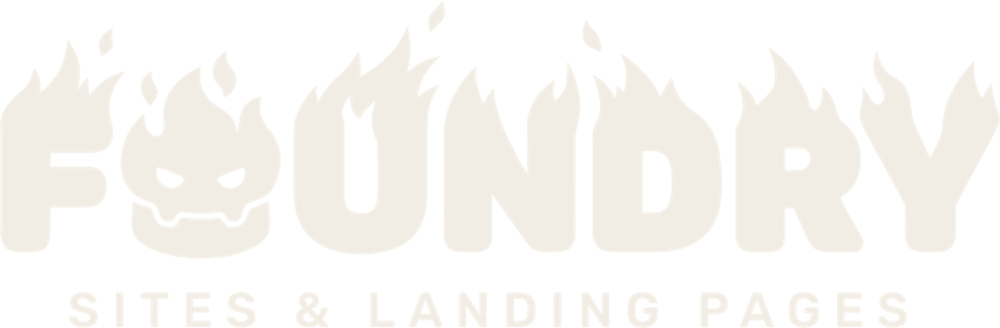
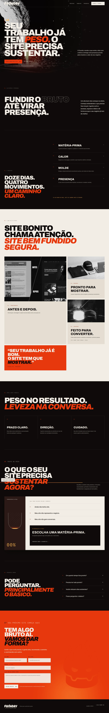

<p align="center">
  
</p>

# Foundry

<p align="center"><strong>Landing page Astro para uma marca que transforma matéria bruta em presença digital capaz de sustentar o peso do negócio.</strong></p>

<p align="center">
  <a href="../../actions/workflows/ci.yml"></a>
  
  
  <a href="LICENSE"></a>
</p>

<p align="center">
  
</p>

## Início rápido

```bash
git clone https://github.com/LuisMIguelFurlanettoSousa/foundry-site.git
cd foundry-site
npm install
npm run dev
```

## Recursos

- Astro estático para entregar conteúdo com JavaScript mínimo
- Imagens responsivas para reduzir transferência em telas menores
- Identidade visual baseada no Brand Book oficial da Foundry
- Narrativa de matéria-prima, calor, molde e presença
- Menu móvel acessível para orientar sem ocupar a tela
- FAQ nativo com teclado e sem dependências
- Efeitos de calor em CSS para evitar WebGL e bibliotecas pesadas
- Respeito a `prefers-reduced-motion` para reduzir animações
- Página 404 própria com o mascote Cadinho
- Testes estruturais e verificação de tipos no CI

## Comandos

```bash
npm run dev      # inicia o ambiente local
npm test         # executa os testes estruturais
npm run build    # valida tipos e gera a build estática
npm run preview  # serve a build de produção
```

## Estrutura

```text
src/
├── assets/       # mídia otimizada pelo Astro
├── components/   # cabeçalho, ícones e rótulos
├── layouts/      # documento base e metadados
├── pages/        # página inicial e erro 404
└── styles/       # tokens e sistema visual
```

## Contribuição

Leia o [guia de contribuição](CONTRIBUTING.md) antes de abrir uma mudança.

## Licença

O código está sob a [licença MIT](LICENSE). A identidade, os logos e as imagens da Foundry pertencem aos respectivos titulares e não são redistribuídos como material de domínio público.

Fotografia adicional de fundição por [Mehmet Turgut Kirkgoz no Pexels](https://www.pexels.com/photo/industrial-foundry-worker-pouring-molten-metal-37363778/).

<p align="center">Gostou da execução? Deixe uma star para acompanhar o projeto.</p>
